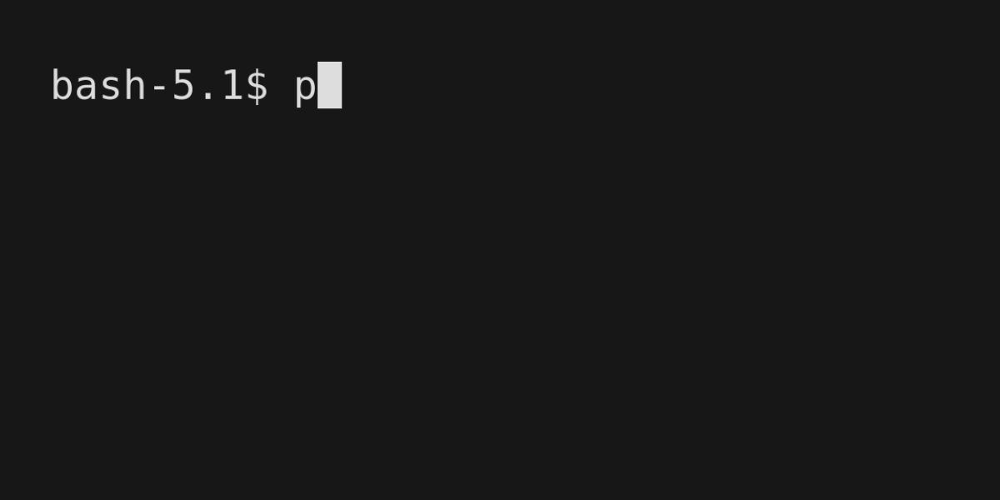

# Utilizando MLPs

Implementar um MLP para resolver o problema do XOR.

---

### Sem utilizar torch 

Arquivo `mlq_xor.py`



---

### Utilizando torch 

Arquivo `mlq_xor_torch.py`


---

## Execução

Certifique-se de ter o `Torch` e `Numpy` instalados em seu sistema:

```bash
pip install torch
```

```bash
pip install numpy
```

Baixe todas as dependências:

```bash
pip install -r requirements.txt
```

Para executar siga os seguintes passos:

1. Clone o repositório:

```bash
git clone https://github.com/rafaelarojas/mlp_xor.git
```

2. Para executar o MLP sem utilizar `Torch`:

```bash
python3 mlp_xor.py
```

2. Para executar o MLP que utiliza `Torch`:

```bash
python3 mlp_xor_torch.py
```